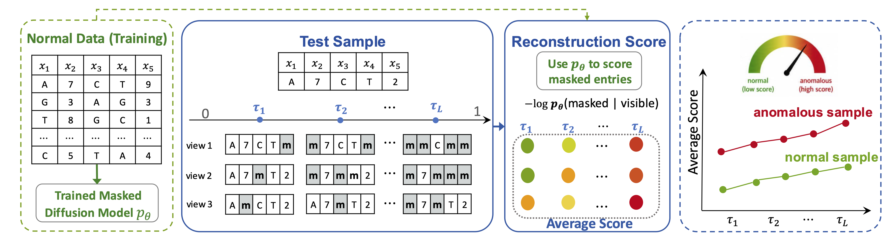

# MaskDiff-AD: Masked Diffusion Modeling for Anomaly Detection

<p align="center">
  
</p>

PyTorch implementation of **Masked Diffusion Modeling for Anomaly
Detection**.

MaskDiff-AD detects anomalies in discrete representations by masking parts of
an input and measuring how surprising their reconstructions are under a model
fit only on normal training samples. This repository includes implementations
for tabular/categorical data and tokenized text data.

## Highlights

- Forward-only anomaly scoring through masked reconstruction likelihood.
- Non-parametric and parametric reconstruction (REC) variants for tabular
  anomaly detection.
- Transformer-based parametric REC model for text anomaly detection.
- Evaluation with ROC-AUC and PR-AUC with CSV result export.
- A bundled U2R example for an immediate tabular run.

## Method

Given a clean sample \(x\), MaskDiff-AD draws masked probe views at
different masking levels. A reconstruction model estimates the conditional
distribution of the masked entries given their visible context. The anomaly
score is the average negative log-likelihood of the original masked entries
across probe levels and random views. Samples that are inconsistent with
normal dependencies receive higher scores.

This release provides the following REC scorers:

| Setting | Implementation | Description |
| --- | --- | --- |
| Tabular | `NonParametricMDADRec` | Kernel-smoothed conditional reconstruction using normal reference samples. |
| Tabular | `ParametricMDADRec` | Neural masked-coordinate reconstruction model. |
| Text | `ParametricMDADRecText` | Transformer encoder trained to reconstruct masked tokens. |

## Repository Structure

```text
MaskDiff-AD/
|-- data/tabular/ADBenchmarks/       # Bundled U2R demo and optional downloaded ARFF files
|-- dataset_configs/                 # Tabular and NLP-ADBench dataset loaders
|-- experiments/                     # Experiment entry points
|-- models/mdad/                     # MaskDiff-AD REC implementations
|-- preprocess/                      # Discrete tabular preprocessing
|-- utils/                           # Metrics and result serialization
|-- run_tabular.sh                   # Tabular non-parametric + parametric run
|-- run_text.sh                      # Text parametric run
`-- requirement.txt
```

## Installation

Create a Python environment and install the dependencies:

```bash
conda create -n mdad python=3.11
conda activate mdad
pip install -r requirements.txt
```

## Data

### Tabular ADBenchmarks

The repository includes the U2R data file used by the default quick start:

```text
data/tabular/ADBenchmarks/kddcup99-corrected-u2rvsnormal-nominal-cleaned.arff
```

The tabular datasets are based on the categorical anomaly detection datasets
from the [ADBenchmarks anomaly detection dataset repository][adbenchmarks-repo],
especially the [categorical data folder][adbenchmarks-categorical].

The available tabular dataset identifiers are:

```text
ad, aid362, apas, bank, census, chess, cmc, covertype, probe, r10, solar, u2r, w7a
```

For datasets other than `u2r`, place the corresponding ARFF files under
`data/tabular/ADBenchmarks/` using the paths declared in
`dataset_configs/tabular/ADBenchmarks/`.

The tabular pipeline performs a stratified train/test split, trains only on
normal samples from the training split, and encodes the input into discrete
feature values before fitting MaskDiff-AD.

### Text NLP-ADBench
Text experiments are based on [NLP-ADBench][nlp-adbench-repo]. The code loads
`kendx/NLP-ADBench` through the Hugging Face `datasets` package and tokenizes
text with the GPT-2 tokenizer. The first run therefore downloads the dataset
and tokenizer files unless they are already cached.

Supported text task aliases are:

| Alias | NLP-ADBench task |
| --- | --- |
| `sms` | SMS spam classification |
| `ag_news` | AG News Classification |
| `email_spam` | To check if an email is a spam |
| `yelp` | Yelp reviews dataset consists of reviews from Yelp |


[adbenchmarks-repo]: https://github.com/mala-lab/ADBenchmarks-anomaly-detection-datasets
[adbenchmarks-categorical]: https://github.com/mala-lab/ADBenchmarks-anomaly-detection-datasets/tree/main/categorical%20data
[nlp-adbench-repo]: https://github.com/USC-FORTIS/NLP-ADBench
[nlp-adbench-hf]: https://huggingface.co/datasets/kendx/NLP-ADBench

## Quick Start

Run both tabular REC variants on the bundled U2R example:

```bash
bash run_tabular.sh
```

Run the default text experiment on the SMS task:

```bash
bash run_text.sh
```

## Experiments

### Tabular Anomaly Detection

Run either tabular model independently:

```bash
# Non-parametric REC
python -m experiments.run_mdad_nonparametric_rec --dataset u2r --seed 4

# Parametric REC
python -m experiments.run_mdad_parametric_rec --dataset u2r --seed 4
```

Useful tabular options include:

| Argument | Description |
| --- | --- |
| `--dataset` | Registered tabular dataset identifier. |
| `--seed` | Random seed for splitting, masking, and model training. |
| `--mask-schedule` | Comma-separated masking probabilities. |
| `--probe-times` | Comma-separated mask levels used for scoring. |
| `--n-probe-views` | Random masked views per probe level. |
| `--max-test-samples` | Restrict test examples for a quick run; `0` uses all samples. |
| `--output-root` | Root directory for result CSV files. |

The parametric entry point additionally exposes architecture and optimization
options such as `--rec-epochs`, `--d-model`, `--hidden-dim`, and `--lr`. The
non-parametric entry point exposes `--lambda-kernel`, `--ref-subsample`, and
`--ref-chunk-size`.

### Text Anomaly Detection

Run a specified NLP-ADBench task:

```bash
python -m experiments.run_mdad_parametric_rec_text \
  --task "SMS spam classification" \
  --seed 123
```

The text entry point exposes `--max-length`, transformer architecture options,
training options, probe-view options, and sample limits for controlled
experiments.

## Citation

If you find this repository useful in your research, please cite:

```bibtex
@article{zhang2026maskdiffad,
  title={Masked Diffusion Modeling for Anomaly Detection},
  author={Zhang, Lixing and Liang, Yuchen and Xie, Liyan},
  journal={arXiv preprint arXiv:2605.30046},
  year={2026}
}
```

## License

This project is released under the [MIT License](LICENSE).
